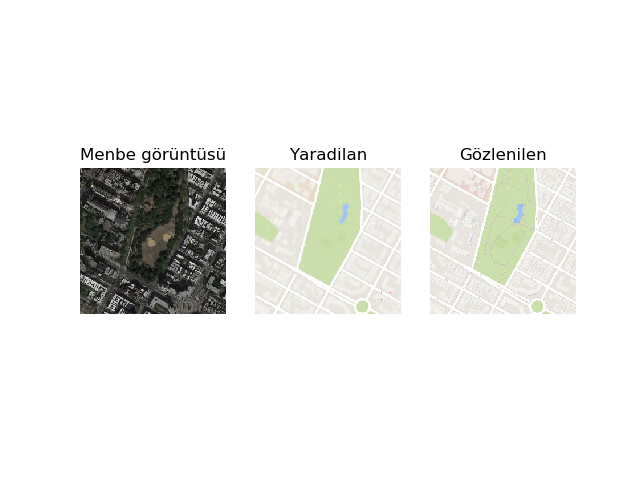

# Pix2Pix Image-to-Image Translation

This project provides a `TensorFlow/Keras` implementation of the Pix2Pix conditional GAN (cGAN) for image-to-image translation. It is demonstrated on the task of translating between satellite and map images, but can be adapted for other domains.

The implementation is based on the paper ["Image-to-Image Translation with Conditional Adversarial Networks"](https://arxiv.org/abs/1611.07004) by Isola et al.



## Features

- **Bidirectional Image Translation**: Translate from satellite to map (`sat2map`) or map to satellite (`map2sat`).
- **Pix2Pix Architecture**: A U-Net based generator and a PatchGAN discriminator.
- **Command-Line Interface**: Easy-to-use scripts for data preparation, training, translation, and evaluation.
- **Explainable AI (XAI)**: Integrated tools to visualize and understand model behavior using `Grad-CAM` and `LIME`.
- **Checkpointing**: Automatically saves model checkpoints and visual progress during training.

## Installation

1.  Clone the repository:
    ```bash
    git clone https://github.com/your-username/Image-Translation.git
    cd Image-Translation
    ```

2.  Install the required Python packages:
    ```bash
    pip install -r requirements.txt
    ```

## Dataset

The model is trained on pairs of images. For the satellite-to-map task, these are pairs of satellite and map images. The training data should be organized in a single directory, where each image file is a composite of the source and target image placed side-by-side. For example, a 512x256 image where the left 256x256 half is the satellite view and the right 256x256 half is the corresponding map view.

A sample dataset is available from [here](http://efrosgans.eecs.berkeley.edu/pix2pix/datasets/maps.tar.gz).

### Data Preparation

Once you have downloaded and extracted the dataset, you need to prepare it for training using the `data_preparation.py` script. This will create a compressed NumPy array (`.npz`) file.

```bash
python data_preparation.py --input_dir /path/to/your/dataset/train --output_file maps_256.npz
```

## Usage

### Training

To train a new model, use the `train.py` script. You need to specify the direction of translation (`sat2map` or `map2sat`).

```bash
# For satellite-to-map translation
python train.py --direction sat2map --dataset_path maps_256.npz --n_epochs 200

# For map-to-satellite translation
python train.py --direction map2sat --dataset_path maps_256.npz --n_epochs 200
```

-   `--direction`: The translation direction.
-   `--dataset_path`: Path to the prepared `.npz` dataset file.
-   `--n_epochs`: Number of training epochs.
-   `--batch_size`: Batch size for training.

Model checkpoints will be saved in the `checkpoints/` directory, and sample translated images will be saved in the `images/` directory.

### Translation

To translate a single image, use the `translate.py` script.

```bash
python translate.py --model_path checkpoints/model_sat2map_109600.h5 --image_path path/to/your/input_image.png --output_path translated_image.png
```

-   `--model_path`: Path to the trained generator model (`.h5` file).
-   `--image_path`: Path to the input image.
-   `--output_path`: Path to save the translated image.

### Evaluation and Explainability (XAI)

To evaluate the model and generate explainability visualizations, use the `evaluate.py` script. You can choose between two methods: `gradcam` and `lime`.

```bash
# Using Grad-CAM
python evaluate.py --method gradcam --model_path checkpoints/model_sat2map_109600.h5 --dataset_path maps_256.npz

# Using LIME
python evaluate.py --method lime --model_path checkpoints/model_sat2map_109600.h5 --dataset_path maps_256.npz
```

-   `--method`: The explainability method (`gradcam` or `lime`).
-   `--model_path`: Path to the trained generator model.
-   `--dataset_path`: Path to the dataset for sampling an image to evaluate.

The script will display a plot showing the input image, the generated image, the ground truth, and the explainability visualization.

## License

This project is licensed under the MIT License - see the [LICENSE](LICENSE) file for details.
